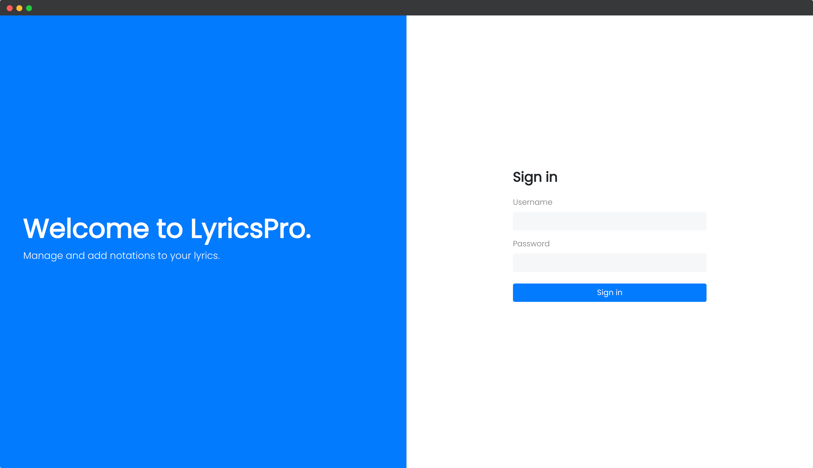
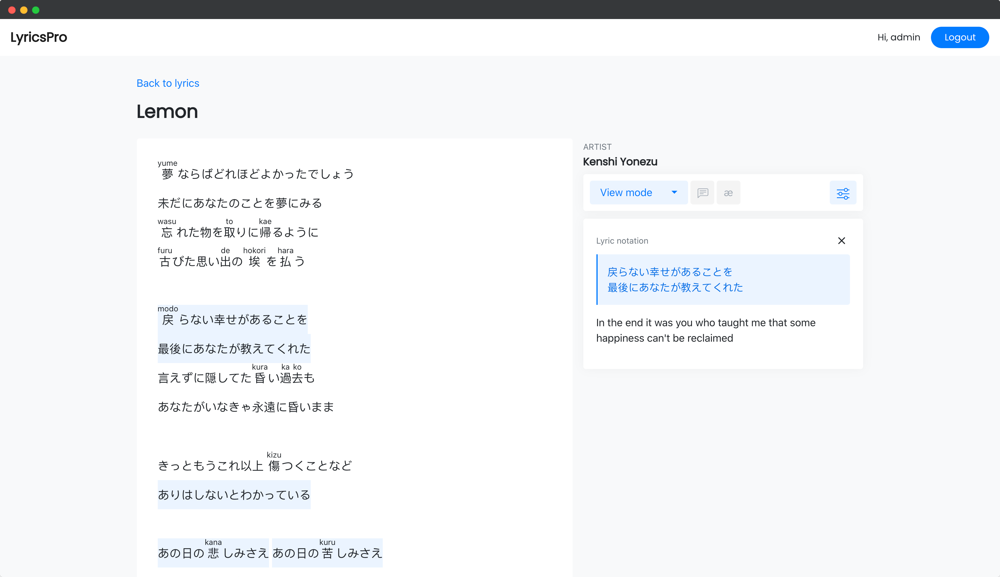

# Lyrics Pro
Manage your song lyrics, add notations, and learn efficiently.

## Getting started
1. Clone and `cd` into this project
2. Create virtual environment `virtualenv .virtualenv`
3. Activate the virtual environment `source .virtualenv/bin/activate`
4. Install packages `pip install -r requirements.txt`
5. Start the development server `python manage.py runserver`
